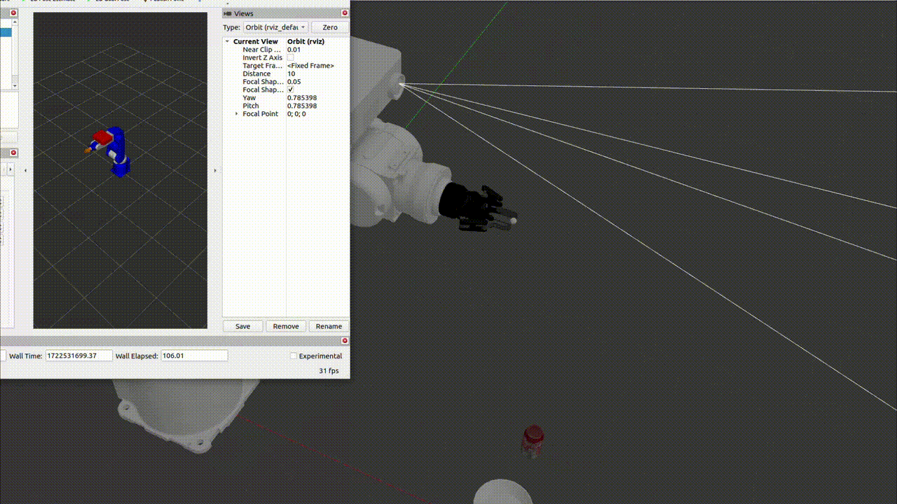

# Robot Arm Simulation with 3D Sensor

## Pre-Requisites
- Ubuntu 22.04
- Moveit2
- ROS2-Humble
- ROS2 Controller Library
- ROS2 Gazebo Controller Library
- Gazebo-Ros

## Commands to install ROS2 and dependencies

```bash

sudo apt-get update

sudo apt-get install ros-humble-joint-state-publisher-gui
sudo apt-get install ros-humble-xacro
sudo apt-get install ros-humble-gazebo-ros
sudo apt-get install ros-humble-ros2-control
sudo apt-get install ros-humble-ros2-controllers
sudo apt-get install ros-humble-gazebo-ros2-control
sudo apt-get install ros-humble-moveit
sudo apt install ros-humble-gazebo-ros-pkgs
sudo apt install ros-humble-rmw-cyclonedds-cppexport
# add following line into the ~/.bashrc 
sudo export RMW_IMPLEMENTATION=rmw_cyclonedds_cpp
``` 

## Commands to install Cuda for the GPU  

```bash

vidia-smi

Thu Jan  4 11:24:58 2024       
+---------------------------------------------------------------------------------------+
| NVIDIA-SMI 535.129.03             Driver Version: 535.129.03   CUDA Version: 12.2     |
|-----------------------------------------+----------------------+----------------------+
| GPU  Name                 Persistence-M | Bus-Id        Disp.A | Volatile Uncorr. ECC |
| Fan  Temp   Perf          Pwr:Usage/Cap |         Memory-Usage | GPU-Util  Compute M. |
|                                         |                      |               MIG M. |
|=========================================+======================+======================|
|   0  NVIDIA RTX A1000 6GB Lap...    Off | 00000000:01:00.0 Off |                  N/A |
| N/A   58C    P0              12W /  35W |      8MiB /  6144MiB |      0%      Default |
|                                         |                      |                  N/A |
+-----------------------------------------+----------------------+----------------------+
                                                                                         
+---------------------------------------------------------------------------------------+
| Processes:                                                                            |
|  GPU   GI   CI        PID   Type   Process name                            GPU Memory |
|        ID   ID                                                             Usage      |
|=======================================================================================|
|    0   N/A  N/A      3219      G   /usr/lib/xorg/Xorg                            4MiB |
+---------------------------------------------------------------------------------------+


# CUDA 12.X installation
pip install --upgrade "jax[cuda12_pip]" -f https://storage.googleapis.com/jax-releases/jax_cuda_releases.html

#### OR ####

# CUDA 11.X installation
# Note: wheels only available on linux.
pip install --upgrade "jax[cuda11_pip]" -f https://storage.googleapis.com/jax-releases/jax_cuda_releases.html


python -c "import jax; print(f'Jax backend: {jax.default_backend()}')"
Jax backend: gpu 


# Instruction order to launch the simulation

1. ros2 launch yaskawa_mh5_description gazebo.launch.py
2. ros2 launch yaskawa_mh5_controller controller.launch.py
3. ros2 launch yaskawa_mh5_moveit2 moveit.launch.py
4. ros2 launch robotic_opencv opencv_subs.launch.py
5. ros2 run robotic_actions taskservernode
6. ros2 run robotic_ai_model task_client
``` 



